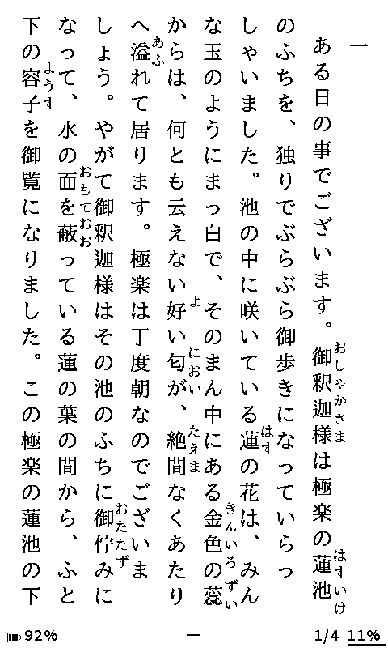

# CrossPoint Yomuka

> [!IMPORTANT]
> **Beko6648フォークの開発状況メモ**
>
> Xteink X3用に、本家`v0.3.7`(コミット`124a5da`)から分岐し、本家`v0.3.8.1`の修正（文字重なり・英文空白）も取り込んだうえで、以下の修正を加えています。
>
> **修正済み**
> - **XTCHスリープ表紙のグレースケール化**:上流に取り込み済み
> - **キャッシュ生成終了時のフォントキャッシュ解放**:上流に取り込み済み
> - **インライン画像の文字化**:上流に取り込み済み
> - **画像ページの描画速度改善**(14秒→4秒):上流に取り込み済み
> - **全角空白(U+3000)の表示**(上流v0.3.8.2取り込み):行頭の全角空白が消えてしまう問題を修正。従来は全角空白を空白としてスキップしていたため、行頭の全角空白(インデント等)が表示されなかった。上流v0.3.8.2の実装に合わせ、全角空白を通常の文字として表示するように変更。
> - **ページ送り中インジケータ**:ページ送り操作を受け付けたときに、ステータスバーに**送り方向の矢印**(◀/▶)を一瞬表示。e-inkの描画待ち時間に「反応した」ことが伝わる。ステータスバーカスタマイズでオン/オフ可能(実機・web両対応)。drawLineで図形描画(フォント非依存で「?」化しない)。バッテリー残量表示の右側に配置し、しおり表示とも重ならない。**EPUB専用**(XTCはページ画像にステータスバー込みのため対象外)。
> - **章一覧から「ファイル途中を指す目次項目」を除外**:1つのXHTMLファイル内に複数の章・脚注が同居するEPUB(例:三体2下巻の第2〜5章がc246.xhtmlに同居)で、`c246.xhtml#a3H8`のように**アンカー付きでファイル途中を指す目次項目**が章一覧に並んでしまう問題を修正。`createTocEntry`で`anchor`が空でないTOC項目をスキップし、**ファイル全体を指す項目だけを章として表示**。Kindleアプリと同様の章一覧になる(大区分のみ表示)。`BOOK_CACHE_VERSION`を8にbump(既存book.bin再生成)。
> - **縦書きの段落配置を両端揃え(Justify)に固定**:縦書きは列位置が右詰め固定で`paragraphAlignment`が描画に反映されず、インデント判定(`Justify||Left`)のみに使われる。そのため縦書き設定で「中央揃え」「右揃え」を選ぶと**行頭インデントが機能しない**不整合があった(Kindleは段落配置が両端揃えデフォルトのためインデントが付く)。縦書きの段落配置をJustifyに固定し、縦書き設定画面の「段落配置」項目を削除(横書きは従来どおり選択可能)。`SECTION_FILE_VERSION`を79にbump。実機確認済み(2026-08-17)。
> - **行頭が全角空白で始まる段落の二重インデントを解消**:行頭インデントを全角空白(U+3000)で表現している書籍(文庫系EPUBの一般的な形式)で、全角空白の表示(v0.3.8.2以降)と行頭インデント機能が重複して**2文字分**空いてしまう問題を修正。段落の先頭がU+3000で始まるときはリーダーの自動インデントを適用しない(Kindle相当・全角空白がインデントの役割を果たす)。縦書き(`verticalIndent`)・横書き(`textIndent`注入)の両方に適用。`SECTION_FILE_VERSION`を80にbump。実機確認済み(2026-08-17)。上流PR #21として投稿。
> - **拡張フォント「NotoSerifJp-Ext」とフォントビルドスクリプトの拡張**(2026-08-18):JIS X 0213に加えて**CJK拡張A漢字(U+3400-4DBF・全6,592字)**を収録した明朝フォントを配布。Noto Serif CJK JP フル版ベースで収録漢字**約30,007字**(既存Plus版の約2.2倍)。フォントビルドスクリプト(`fontconvert_sdcard.py`)に`arrows`(上流v1.3.0と同一・上流配布物とバイナリ一致を検証済み)と`cjk_exta`(フォーク独自)プリセットを追加。拡張B(U+20000-)は縦書き表示非対応のため未収録。配布: `fonts/NotoSerifJp-Ext/`。実機確認済み(2026-08-18)。
>
> **意図的に取り込んでいない上流機能**
> - **縦書きでの矢印(←↑→↓)の直立表示**(上流v0.3.8.2):上流は縦書きで矢印を「直立(回転なし)」表示する変更を入れたが、**Kindle版と表示の向きが一致しない**ため、フォークでは意図的に取り込まない。Kindle版では矢印は回転(Sideways)表示されており、フォークは従来どおり回転表示を維持してKindle版と挙動を一致させる。※ この判断は実機でのKindle版との比較確認に基づく(2026-08-16)。
>
> **未解決(既知の問題)**
> - **XTCHの「メモリエラー」**:キャッシュ生成プロセスがヒープを断片化させることが原因と判明。再現手順:XTCHを開く→他EPUBのキャッシュ生成→最初のXTCHを再度開く。診断:空きヒープ152KBなのに最大連続ブロック54KB(断片化)。幅0回避とは無関係。EPUB読書には影響しないため一旦保留。
>
> **ブランチ運用**:`main`ブランチ=実機に適用している安定版FWの基準。デフォルトブランチ。改修時は必ず`main`から新ブランチを派生し、成功したら`main`に取り込む。

> 日本語の基本操作と、表示トラブル時の安全な確認方法は [基本操作と困ったときの確認](docs/basic-operations-ja.md) を参照してください。

CrossPoint Yomukaは、Xteink X3向けの日本語読書に特化したオープンソースファームウェアです。

このリポジトリでは、本家CrossPointおよび既存のCrossPoint JPをベースに、日本語EPUBの縦書き表示、ルビ、縦中横、日本語UI、青空文庫からの直接ダウンロードなど、日本語の書籍を読みやすくするための機能追加と改善を行っています。

v0.2.9まではCrossPoint JPとして提供し、v0.3.0からは正式名称を「CrossPoint Yomuka」、画面上と配布物の短い表記を「Yomuka」とします。

開発の優先順位と名称移行の方針は、[ロードマップ](docs/roadmap.md)を参照してください。

<p align="center">
  
  
</p>

<p align="center">
  日本語EPUBの縦書き表示と横書き表示
</p>

> [!WARNING]
> CrossPoint Yomukaは個人開発の非公式ファームウェアです。<br>
> 動作保証はありません。導入や更新は自己責任で行ってください。

## 対応端末

### Xteink X3

Beko6648フォークの主な開発・動作確認対象です。開発メモ冒頭の修正は、すべてX3で実機確認済みです。

### Xteink X4

本家（ponto1216版）の主な対象です。Beko6648フォークはX3を主対象としており、X4での実機確認は十分に行われていません。

## 対応フォーマット

| 形式 | 対応状況 |
|---|---|
| EPUB | 縦書き・横書き対応 |
| TXT | 横書きのみ対応 |
| XTC | 対応 |
| PDF | 非対応 |

EPUBの表示は、すべてのCSSやレイアウトを完全に再現するものではありません。

複雑な装飾、固定レイアウト、特殊な段組みなどは、簡略化されたり、正しく表示されなかったりする場合があります。

## 現在の主な改善点

CrossPoint Yomuka（ponto1216版）では、既存のCrossPoint JPをベースに、現在も利用できる日本語表示、安定性、操作性の改善を行っています。

### 縦書き・ルビ表示

- 日本語EPUBの縦書きレイアウトを調整
- 縦書きと横書きのページ送り方向を調整
- ルビの表示位置調整機能を追加

### EPUB・画像表示

- 大容量EPUBを開く際のメモリ使用量を削減
- CSSの読み込み処理を軽量化
- EPUB内のPNG・JPEG画像表示を改善
- 画像の縦横比と中央配置を調整
- 親要素の余白内に画像が収まるように改善
- 挿絵が多い作品での安定性を改善
- 画像キャッシュによる再表示速度を改善
- 特殊なEPUB構造や古いキャッシュへの対応を強化

### キャッシュ・読書進捗

- 初回キャッシュ生成後の表示速度を改善
- キャッシュ生成の進捗表示を追加
- 読書進捗を安全に保存する処理を追加
- 書き込み中の電源断で進捗ファイルが破損しにくいように改善
- キャッシュの検証と再構築処理を強化

### 日本語UI・フォント

- 日本語UI向けフォントの表示文字を拡張
- 読書用日本語フォントの対応文字を拡張
- 縦書きと横書きで個別に表示設定を保存
- 長いタイトルやダイアログの表示位置を改善
- 設定項目の名称や選択肢を分かりやすく整理

### 安定性・ファイル対応

- 大容量XTCファイルでの起動失敗を改善
- EPUB解析時のメモリ不足を軽減
- ファイルや画像処理後のリソース解放を改善
- SDカードへのファイル書き込み処理を安全化
- 横書きTXTファイルの閲覧に対応
- SDカードからのファームウェア更新機能を追加

## v0.2.7での主な改善

v0.2.7では、設定画面の操作性とキャッシュ生成処理を中心に改善しました。

- 設定画面の操作方法を整理
- サイドキーによるタブ移動に対応
- 余白や文字間隔などの選択肢を分かりやすい表現へ整理
- キャッシュ生成中の案内表示を改善
- キャッシュ生成のキャンセル操作を分かりやすく改善
- EPUBキャッシュ生成の中断・再開処理を改善
- キャッシュ生成完了の判定を改善
- EPUB・TXTの読書進捗保存を安全化
- CSSキャッシュの検証を強化
- ダイアログの文章や表示位置を調整
- UI全体の操作感と表示を改善

詳しい変更内容は、GitHub Releasesを確認してください。

## 既知の問題・制限事項

CrossPoint Yomuka（ponto1216版）には、現在次の問題や制限があります。

### 青空文庫

- 青空文庫から直接ダウンロードした一部の作品を開けない場合があります。
- 作品ごとのEPUB構造や章分けの違いにより、解析やキャッシュ生成に失敗する場合があります。
- 本文が非常に長い単一ファイルとして収録されている作品では、正常に開けないことがあります。

### EPUB表示

- EPUB内のすべてのCSSやレイアウトを完全に再現するものではありません。
- 複雑な装飾、段組み、特殊な位置指定などは、簡略化されたり正しく表示されなかったりする場合があります。
- 固定レイアウトEPUBには対応していません。
- 特殊な章構成を持つEPUBでは、目次やページ分割が正しく処理されない場合があります。
- 書籍に指定されたスタイルとCrossPoint Yomuka側の表示設定が異なる場合、元の書籍と見た目が変わることがあります。

### 画像表示

- 挿絵が多い作品や画像サイズが大きい作品では、初回の読み込みやキャッシュ生成に時間がかかる場合があります。
- 一部のJPEG画像や特殊な画像形式は、正しく表示されない場合があります。
- 画像のサイズ、余白、配置は、元のEPUBと完全に同じにならない場合があります。
- 画像が多いページでは、電子ペーパー特有の残像が目立つ場合があります。

### TXT

- TXTファイルは現在、横書き表示のみ対応しています。
- 文字コードやファイル内容によっては、文字化けや読み込み失敗が発生する場合があります。
- EPUBと比べて、見出し、ルビ、画像、書籍スタイルなどの機能は制限されます。

### キャッシュ生成

- 初めて書籍を開く際は、キャッシュ生成のため時間がかかる場合があります。
- 挿絵が多い作品では、テキストのみの作品よりキャッシュ生成に時間がかかります。
- キャッシュ生成を中断した場合や、生成中に電源が切れた場合は、次回起動時に再生成が必要になることがあります。
- 不完全または古いキャッシュが残った場合は、読書キャッシュを削除してから書籍を開き直してください。

### 対応端末

- Xteink X3を主な開発・動作確認対象としています。
- 端末やSDカードの状態によって、読み込み速度や安定性が異なる場合があります。

### ファームウェア更新

- ファームウェア更新中は、電源を切ったりSDカードを抜いたりしないでください。
- 更新前に、SDカード内の書籍、フォント、設定ファイルなど、必要なデータをバックアップしてください。
- 現在、専用のリカバリーモードは実装されていません。

## 不具合報告

問題が発生した場合は、GitHub Issuesから報告してください。

次の情報があると、原因を確認しやすくなります。

- CrossPoint Yomukaのバージョン
- 使用している端末
- 書籍の形式
- 問題が発生した操作
- 再現手順
- 画面に表示されたエラー
- シリアルログ
- 青空文庫作品の場合は作品名

著作権のある書籍ファイルそのものは、GitHub Issuesへ添付しないでください。

## インストール

CrossPoint Yomuka（ponto1216版）は、GitHub Releasesで配布しているファームウェアから導入できます。

### 既にCrossPoint Yomukaを使用している場合

1. GitHub Releasesから最新版のファームウェアをダウンロードします。
2. ファームウェア更新用ファイルを、指定された名前のままSDカードへ配置します。
3. 端末の「SDカードファームウェア更新」を開きます。
4. 画面の案内に従って更新を実行します。
5. 更新完了後、端末を再起動します。

> [!CAUTION]
> 更新中は電源を切ったり、SDカードを抜いたりしないでください。  
> 更新前に、必要な書籍、フォント、設定ファイルなどをバックアップしてください。

### 初めて導入する場合

初回導入手順は現在整理中です。

今後、必要なファイル、PCからの書き込み方法、SDカード更新手順をまとめたインストールガイドを追加する予定です。

## フォント

日本語EPUBを表示するには、CrossPoint Yomukaに対応した読書用フォントが必要です。

ダウンロードしたフォントは、SDカード直下の `fonts` フォルダへ配置することを推奨します。

```text
SDカード/
└─ fonts/
   └─ フォント名/
      ├─ フォント名_8.cpfont
      ├─ フォント名_10.cpfont
      ├─ フォント名_12.cpfont
      ├─ フォント名_14.cpfont
      ├─ フォント名_16.cpfont
      └─ フォント名_18.cpfont
```

フォントごとに専用のフォルダを作成し、その中へ各サイズの `.cpfont` ファイルを配置してください。

次の場所に配置されたフォントも読み込めます。

- `/fonts/`：推奨
- `/.font/`：対応
- `/.crosspoint/fonts/`：旧バージョンとの互換用

新しく配置する場合は、管理しやすい `/fonts/` の使用をおすすめします。

配置後に端末を再起動すると、設定画面の読書フォント一覧から選択できるようになります。

フォントにはそれぞれ個別のライセンスが適用されます。配布ファイルに含まれるライセンス文書も確認してください。

## ライセンス

CrossPoint Yomukaのライセンスは、リポジトリ内のライセンスファイルを確認してください。

使用しているフォント、ライブラリ、画像などには、それぞれ個別のライセンスが適用される場合があります。

## 謝辞

CrossPoint Yomukaは、本家CrossPoint、既存のCrossPoint JP、および関連するオープンソースプロジェクトの成果を基に開発されています。

本家の開発者、CrossPoint JPの開発者、貢献者、ライブラリ作者、フォント作者の皆さまに感謝します。
