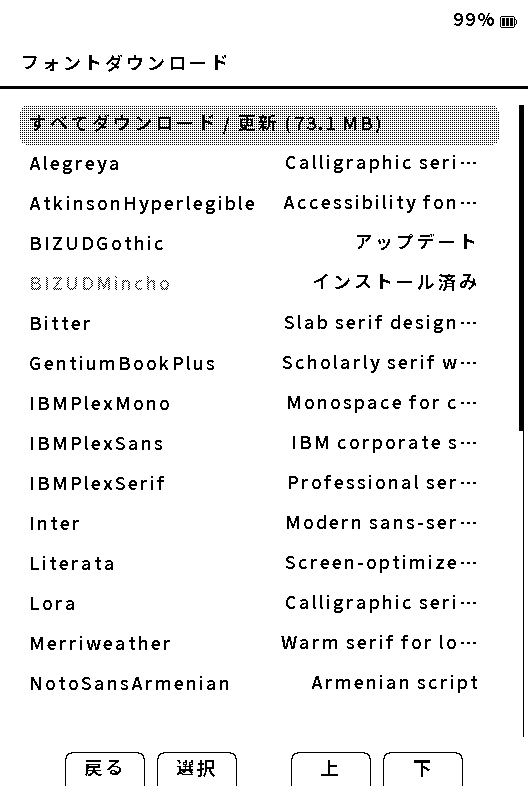
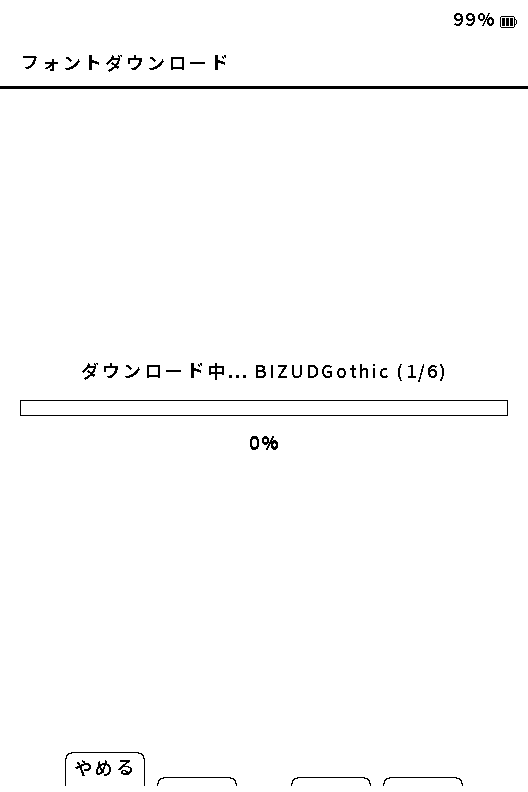

# 日本語フォントの導入

[マニュアルの目次](manual-ja.md)

Yomukaは、読書用の日本語フォントをSDカードへ追加できます。横書き・縦書きの設定で使うフォントを選べるため、書籍や読み方に合わせて明朝・ゴシックを使い分けられます。

## まずは配布ZIPを使う

最も確実な方法は、[SD Card Fontsの配布ページ](https://github.com/ponto1216-ai/crosspoint-jp/releases/tag/sd-fonts)から `Yomuka-Font-<family>.zip` をPCへダウンロードし、ZIPをSDカードのルートへ展開する方法です。

展開後の構成は次のようになります。

```
SDカードのルート
└─ .fonts
   └─ <family>
      └─ *.cpfont
```

導入後は端末を再起動し、**設定 → 読書 → 横書き設定** または **縦書き設定** からフォントを選びます。

日本語向けには、BIZ UD Gothic、BIZ UD Mincho、Noto Sans JP、Noto Serif JP、Zen Maru Gothicを配布しています。現在の配布物には本文用に加えて、ルビ用の小さい文字と、表・上付き／下付きなどに使う小さい文字のデータが含まれます。更新済みの日本語フォントにはキリル文字、`℃`、`ℓ`が含まれ、Noto系とZen Maru Gothicには`℉`も含まれます。収録内容とライセンスは各配布物の案内を確認してください。

Zen Maru Gothicはフォント元に実在する字形から読書用の収録範囲を作っています。通常の日本語本文と代表的な記号は確認していますが、異体字・珍しい漢字・特殊記号など、フォントにない文字は表示できません。これは他のフォントでも起こり得るため、文字が欠ける場合はBIZ UD系またはNoto系へ切り替えて比較してください。

## Wi-Fiでダウンロードする

Wi-Fiを設定済みなら、端末の **設定 → 読書 → フォントをダウンロード** から対応フォントを直接導入できます。



一覧では、未導入のフォントは説明、導入済みのフォントは **インストール済み**、配布中のファイルと大きさが異なるものは **アップデート** と表示します。選んで **決定** を押すと確認画面へ進みます。

ファームウェア更新後に日本語フォントへ **アップデート** と表示された場合は、フォント側の表示品質・収録文字・メモリ改善も反映するため更新してください。版ごとの対象と注意は、その版のリリースノートを参照してください。



- ファミリー内に複数のファイルがある場合、`3/6` のように現在のファイル数と全体数を表示します。
- **やめる** を選ぶと、その時点で中止できます。途中まで取得したファイルは、同じフォントを再度選んだときに続きから取得します。
- ダウンロード中も POWER + DOWN でスクリーンショットを保存できます。
- ダウンロード中は電源を切らず、SDカードを抜かないでください。
- 通信が中断した場合は、同じ操作をもう一度実行してください。対応する配布物では途中から再開します。
- ファイルの確認が完了するまで、既に導入済みのフォントは置き換えません。

容量や通信量を抑えたい場合、または安定した回線で作業したい場合は、PCでZIPを展開する方法をおすすめします。

## フォントが一覧に出ない場合

1. SDカードに `/.fonts/<family>/*.cpfont` の形で入っているか確認します。
2. ZIPをフォルダごと二重に展開していないか確認します。`.fonts` がSDカード直下にある必要があります。
3. 端末を再起動してから、横書き・縦書きそれぞれのフォント一覧を開きます。
4. SDカードをPCで読み書きした直後は、安全な取り外しを行ってから端末に戻します。

以前の形式である `/fonts/` や `/.crosspoint/fonts/` は互換用に認識される場合がありますが、新しく導入するフォントは `/.fonts/` の配布ZIPを使ってください。

## 表示がおかしい場合

| 症状 | 確認すること |
|---|---|
| 文字が□や?になる | その文字を収録していない可能性があります。BIZ UDまたはNoto系へ切り替えてください。 |
| フォント選択後に本文が読みにくい | 横書き・縦書きの設定で、文字サイズ・行間・字間を合わせ、読書設定テスト表示で比較してください。 |
| ダウンロードが終わらない | Wi-Fi接続とSDカードの空き容量を確認し、同じフォントを再度ダウンロードしてください。 |
| 一部の本だけ表示がおかしい | その本のEPUBスタイル設定とフォントを記録し、診断レポートとともに報告してください。 |

フォントが原因か切り分けたいときは、変更前のフォント名を控え、**設定 → 読書 → 読書設定テスト表示** で縦書き／横書き、通常文字／太字、ルビ、英数字を確認します。その後、別のフォントに一度だけ切り替えて同じ画面を比較してください。特定の本だけで崩れる場合は、テスト表示だけで判断せず、その本の書籍スタイルと本ごとの設定も記録します。

## 自作フォントについて

Yomukaが読み込む読書用フォントは `.cpfont` 形式です。TrueType/OpenTypeファイルをそのままSDカードへ置いても、読書フォントとしては選べません。自作・変換は開発者向けの作業となるため、通常は配布ZIPまたは端末のダウンロード機能を使ってください。

UI用の内蔵CJKフォントは、メニューやダイアログに必要な文字をファームウェアへ同梱したものです。本文用の全文字フォントではなく、読書用のSDフォントを追加・変更してもUIフォントは変わりません。メニューだけで文字が欠ける場合は、本文フォントの入れ直しでは直らないため、画面写真と表示されなかった文言を添えて報告してください。

解決しない場合は[不具合の報告](reporting-bugs-ja.md)を参照してください。
