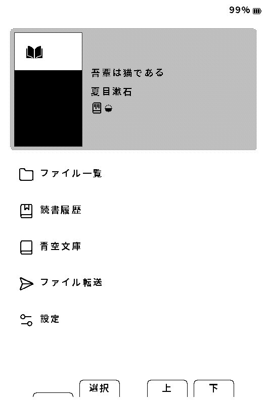
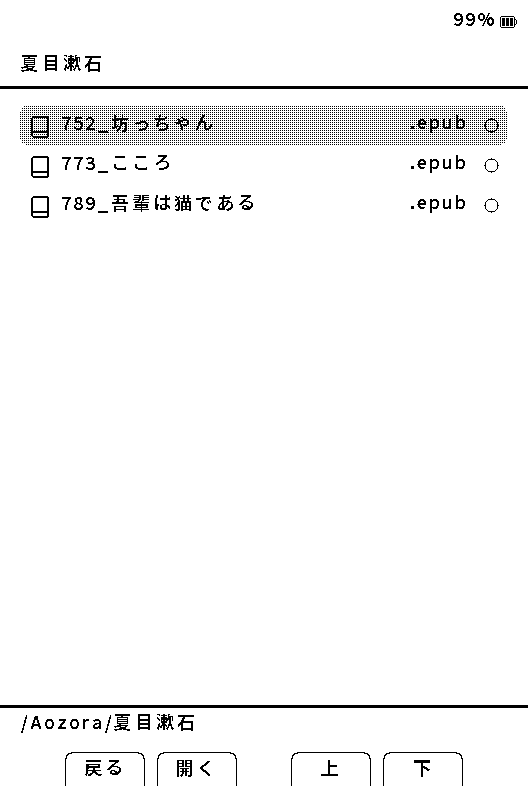

# はじめて使う

[マニュアルの目次](manual-ja.md)

## 用意するもの

Xteink X3またはX4、SDカード、本のファイル、日本語読書用フォントを用意します。PCからSDカードへコピーする場合はカードリーダー、初回書き込みにはデータ通信できるUSB-CケーブルとPCを使います。

X4 Classic（X4 V2）は未対応です。この手順や安定版を使って導入・更新しないでください。Experimental基盤の状況は[X4 Classic Experimental確認手順](x4-classic-experimental-ja.md)を参照してください。

Yomukaは非公式ファームウェアです。導入前にSDカード内の書籍・設定・フォントなど必要なデータをバックアップしてください。

## 最初の1冊を開く

1. 未導入なら[ファームウェアの導入と更新](firmware-update-ja.md)に従って導入します。
2. [日本語フォントの導入](cjk-fonts.md)に従い、配布ZIPをSDカード直下へ展開します。
3. EPUBなどの書籍をSDカードへコピーします。例えば `Books` フォルダを作ると整理しやすくなります。
4. PCからSDカードを安全に取り外して端末へ戻し、起動します。
5. **設定 → 読書** の横書き設定・縦書き設定でフォントを選びます。
6. ホームからファイル一覧を開き、本を選んで **決定** を押します。EPUBの初回表示には解析やキャッシュ生成の時間がかかることがあります。

次はX3・Lyraテーマのホーム画面です。**ファイル一覧** を選ぶと、SDカード内のフォルダと書籍を開けます。

ファイル一覧ではフォルダを開き、読みたい書籍を選んで **決定** を押します。

EPUBは縦書き・横書き、TXTは横書き、XTC/XTCHはページ画像として読めます。PDFは直接開けません。EPUBの複雑なCSSや固定レイアウトは元の表示を完全には再現しません。

## ボタンとスリープ

物理ボタンの役割は端末、画面の向き、割り当てで変わります。画面下部の **戻る／決定／前／次** などの操作名を基準にしてください。

電源ボタンの長押しで起動・スリープします。短押しの動作は設定により異なります。通常のスリープ・再開で本を削除する必要はありません。

止まって操作できない場合は[再起動の手順](troubleshooting-ja.md#画面が止まった起動できない)へ進んでください。更新・フォントDL・キャッシュ生成・SD書き込み中は、電源を切ったりSDカードを抜いたりしないでください。

次は[本を読む](reading-ja.md)と[本の管理](library-ja.md)を参照してください。
