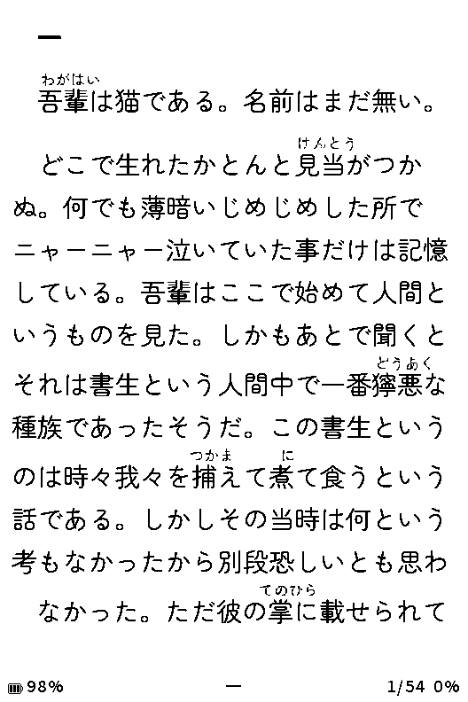
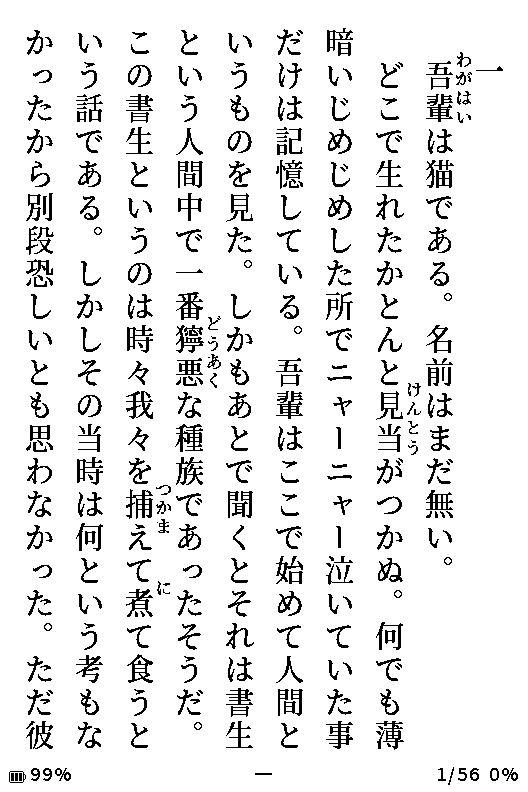
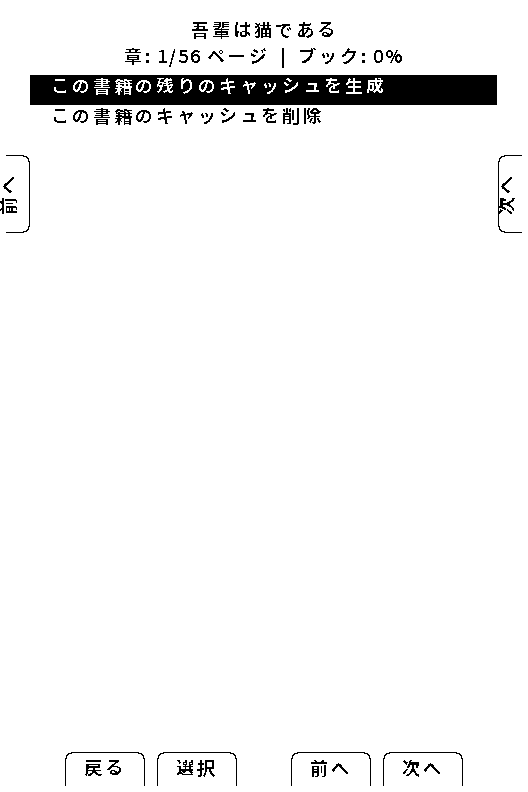
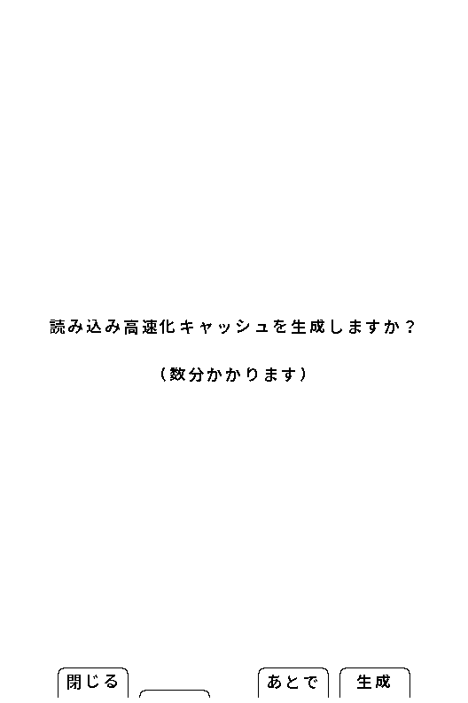
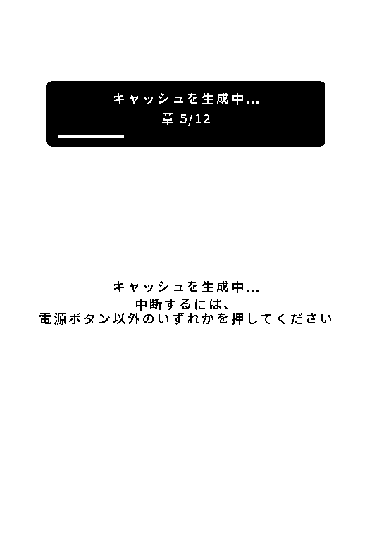
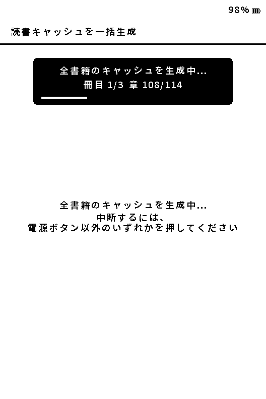
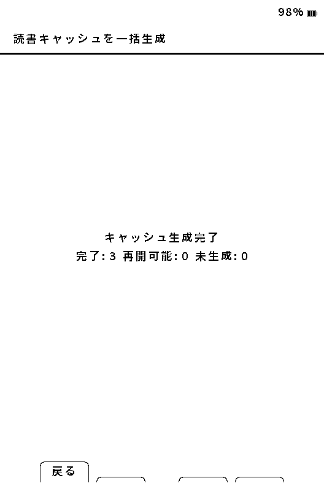

# 本を読む

[マニュアルの目次](manual-ja.md)

## 本を開く・ページをめくる

ファイル一覧で本を選んで **決定** を押します。最近読んだ本は **本の履歴 → 読書履歴** から再開できます。ページ送りは画面の案内と設定したボタン割り当てに従ってください。

長押しのページ送り動作は設定により異なります。[本体と操作の設定](device-settings-ja.md)で割り当てを確認できます。

同じEPUBを横書き・縦書きで表示した例です。フォント、文字サイズ、行間、ルビ位置は読書設定で変更できます。

## EPUBの読書中メニュー

読書中に **決定** を押します。

| メニュー | できること |
|---|---|
| 読書位置 | 章を選択、しおり一覧、しおりを追加／削除、割合で移動 |
| この本の表示 | フォント、文字サイズ、画面の向き、行間、字下げ、ルビ位置、画像反転の調整 |
| 読書動作 | 自動ページ送り、傾きページ送りの設定 |
| 書籍・キャッシュ | この書籍のキャッシュ生成・残りの生成・削除 |
| ツール | スクリーンショット、QR表示、診断 |
| 読書設定 | 本ごとの設定、全体の読書設定 |

しおりを付けるには **読書位置 → しおりを追加／削除** を選びます。同じ場所で再度選ぶと外せます。しおりがある場合に **しおり一覧** が表示されます。

表示設定の優先関係と保存先は[読書の設定](reading-settings-ja.md)を参照してください。TXT・XTC/XTCHでは、EPUBとメニューや利用できる設定が異なります。

**この本の表示 → 文字サイズ** は、決定で変更状態に入り、左／右で **小／中／大／特大** を選びます。決定または戻るで変更状態を閉じると、本文に戻ったときにその本だけの表示として反映されます。

## 読書キャッシュ

EPUBはページ表示を速くするためSDカードへキャッシュを作ります。初回や内容・レイアウトの変更後は生成に時間がかかることがあります。

**決定 → 書籍・キャッシュ** では、未生成なら **この書籍の読書キャッシュを生成**、途中まで生成済みなら **この書籍の残りのキャッシュを生成** を選べます。完了済みの本では生成項目は表示されません。生成を中断するときは、生成画面の中断操作を使い、電源断で止めないでください。

初回に本を開いたときは、読み込み高速化キャッシュを生成するか確認される場合があります。**あとで** を選んで先に本文を開き、読書中メニューから後で生成することもできます。

生成中は章数と進捗を表示します。画面に示されたボタンで中断できます。

**設定 → 本体 → 読書キャッシュを一括生成** では、SDカード内の複数の書籍を続けて処理できます。中断するときは、画面の案内どおり電源ボタン以外を押します。

完了画面では、生成が完了した書籍、途中から再開できる書籍、未生成の書籍の数を確認できます。

表示の問題を調べる場合は、先に[診断レポート](reporting-bugs-ja.md)を残してください。その後、必要な場合に対象の本の **この書籍のキャッシュを削除** を使います。本体設定にある全体の消去とは区別してください。書籍ファイルを削除する必要はありません。

読書位置やしおりの保持については[本の管理](library-ja.md)、生成が進まない場合は[困ったとき](troubleshooting-ja.md)を参照してください。
