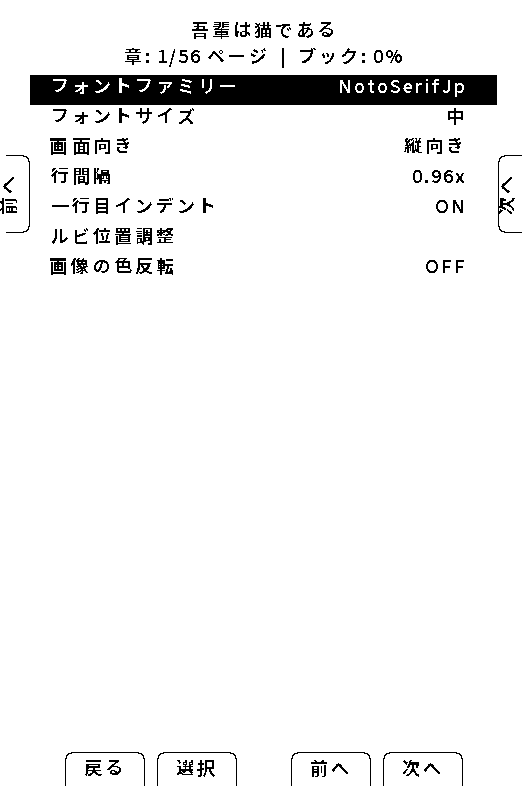
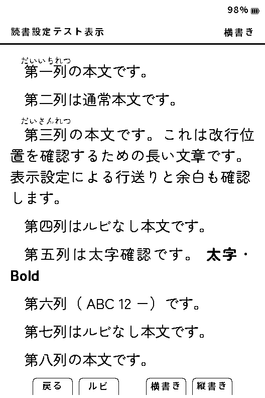
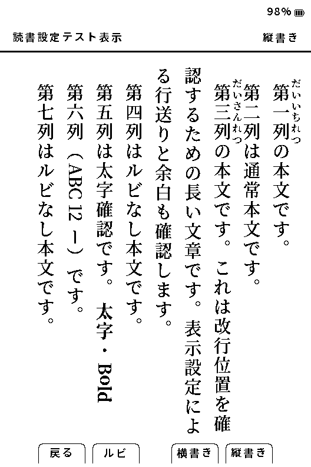

# 読書の設定

[マニュアルの目次](manual-ja.md)

## 文字・レイアウトを変える

横書きと縦書きにはそれぞれ設定があります。**設定 → 読書** から対象の設定を開き、フォント、文字サイズ、余白、行間・字間などを調整します。

EPUBでは書籍のCSSとYomukaの設定の優先関係を選べます。表示がおかしいときは、現在の書籍スタイル設定を記録したうえで、一度だけ別の優先設定に切り替えて比較してください。

書籍スタイルは **CrossPoint優先／書籍優先／バランス** から選べます。文字の見た目を変える前に、どの設定を使っているかを控えておくと比較できます。

## この本だけに設定する（EPUB）

本によって縦横書き、フォント、余白、ルビの見え方を変えたい場合は、EPUBを開いて **決定 → 読書設定 → この本の設定** を開きます。縦書きの本では **縦中横の数字** も本ごとに保存できます。**2桁まで** は1〜2桁、**3桁まで** は1〜3桁の数字を縦中横にし、上限を超える数字列は横倒しで表示します。ここで選んだ項目だけがその本に保存され、他の本とホームの **設定 → 読書** にある全体設定は変わりません。

- 各項目の右側に **この本** と表示されたものは、本ごとの設定が有効です。**全体** は全体設定を使っています。
- `現在の設定を保存` は、その時点の読書設定をまとめて本ごとに保存します。
- 元に戻すときは `全体設定を使用` を選びます。本のファイル、しおり、読書位置は消えません。
- 全体を調整したいときは、同じ **読書設定** 内の `全体の読書設定` を開きます。本ごとの設定がある本では、全体を変更してもその本の上書き項目は維持されます。

文字サイズだけをすぐ変えたいときは、読書中に **決定 → この本の表示 → 文字サイズ** を選びます。決定で編集に入り、左／右で **小／中／大／特大** を選べます。この操作も本ごとの文字サイズとして保存されます。

**この本の表示** には、現在のフォント、文字サイズ、画面の向き、行間、字下げ、ルビ位置などが表示されます。

## 読書設定テスト表示とルビ位置

**設定 → 読書 → 読書設定テスト表示** では、本を開かずに現在の読書設定を確認できます。本文と同じレイアウト処理で、次の項目を一画面で比較します。

- 選択中の本文フォント、文字サイズ、行間・字間
- 縦書き／横書き、長文の改行、句読点・括弧、長音
- 通常文字と太字、ルビ、英数字、縦中横

左／右で横書き・縦書きを切り替えます。**決定** でルビ位置の調整へ入り、画面下部の表示に従ってX/Y方向を変更します。**決定** または **戻る** で確定します。

フォントの導入後や全体設定を変える前後にテスト表示を開くと、同じ例文で差を確認できます。テスト表示は書籍固有のCSS、画像、特殊な章構造までは再現しません。特定の本だけで問題が起きる場合は、その本を開いて **この本の表示** と書籍スタイルも確認してください。

読書中にも **決定 → この本の表示 → ルビ位置調整** から同様に調整できます。本ごとの設定が有効なEPUBでは、その本のルビ位置として保存されます。

## 読書設定プロファイル

**設定 → 読書 → 読書設定プロファイル** では、読書設定を保存・読込できます。試しに設定を変える前に保存しておくと、読み込み直して比較できます。読み込み時は確認画面を読み、結果のメッセージを確認してください。端末にないフォントは代替フォントになる場合があります。

本ごとの設定が有効な項目は全体設定より優先されます。プロファイルを読み込んでも見た目が変わらない場合は、まず **この本の設定** を確認してください。

フォントの追加は[日本語フォントの導入](cjk-fonts.md)、表示の不具合は[困ったとき](troubleshooting-ja.md)へ進んでください。縦書きの判定基準は[開発者向けの表示検証](development/device-verification-ja.md)にまとめています。
