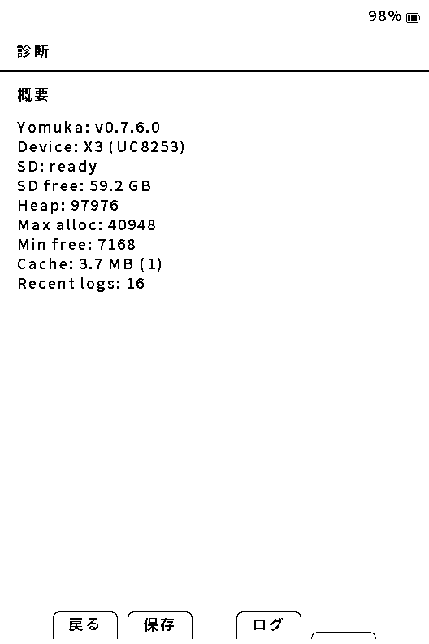
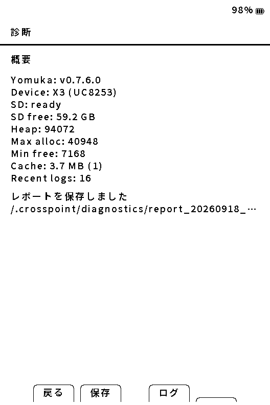
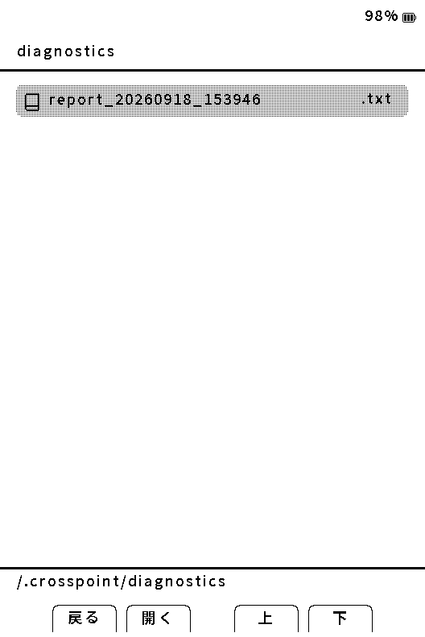

# 不具合の報告

[マニュアルの目次](manual-ja.md)

問題を再現したら、画面の写真と直前の操作を残してください。報告先は [YomukaのGitHub Issues](https://github.com/ponto1216-ai/crosspoint-jp/issues) です。同じ症状の報告があれば、その報告も確認してください。

## 診断レポートを保存する

1. **設定 → 管理 → 診断** を開きます。EPUB読書中は **決定 → ツール → 診断** からも開けます。
2. 画面下部の **保存** を選び、保存完了の表示と保存先を確認します。
3. SDカードへの書き込みが終わってから取り外し、PCで `/.crosspoint/diagnostics/` を開きます。フォルダが見えない場合は隠しファイルの表示を有効にします。
4. 該当する `report_日時.txt` をPCにコピーします。時刻が未設定なら `report_boot_数字.txt` という名前になります。

診断画面には、Yomukaの版、端末、SDカード、メモリ、キャッシュなどの概要が表示されます。値は端末の状態により異なります。



**保存** を選ぶと、レポートの保存完了と保存先が表示されます。



端末のファイル一覧から確認する場合は、`/.crosspoint/diagnostics/` を開くと保存したレポートが表示されます。



診断レポートには、版、端末・表示コントローラ・入力方式、RTC／PSRAM、SDカード容量、空きヒープと最大連続確保量、読書キャッシュの合計、選択中の読書設定、端末内に保持している直近ログを保存します。

EPUB読書中に **決定 → ツール → 診断** から保存した場合は、これに加えて、開いている本の形式・サイズ、キャッシュの生成状態、内容指紋、章番号、ページ番号、章内ページ数を保存します。本体設定から開いた診断では、これらの「読書中の本」項目は記録されません。

本文、ページ画像、スクリーンショット、完全なシリアルログ、クラッシュ時のスタック情報は診断レポートには含まれません。画面写真と一緒に共有すると調査しやすくなります。

## X3の傾きセンサーを報告する

**設定 → 管理 → 傾きセンサー診断** を開き、右と左へ一度ずつ動かして検出結果を確認します。画面下部の **保存** を選ぶと、`/.crosspoint/diagnostics/imu_report_日時.txt` に専用レポートを保存できます。

専用レポートには端末、IMU、I2Cアドレス、FreeInk SDKの版、加速度・角速度、判定軸と閾値、左右の最大値、静止時の揺れ、I2C読み取りエラーなどが含まれます。書籍本文やWi-Fi認証情報は含みません。X4にはこの診断項目は表示されません。

## クラッシュ記録（crashlog）を取り出す

異常終了から再起動した際、SDカードに書き込める場合は、カード直下の **`crash_report.txt`** に原因・直近ログ・スタック情報を保存します。診断レポートとは別のファイルです。

クラッシュ画面が出たら写真を撮り、SDカードの書き込みが終わった後、PCに `crash_report.txt` をコピーしてください。次のクラッシュで上書きされるため、発生日時を付けてPC側に保存すると区別できます。

電源断やすべての停止で作られるわけではありません。ファイルがない場合は「crash_report.txtなし」と書き、写真と再現手順を報告してください。ファイルを得るために繰り返しクラッシュさせる必要はありません。

## 共有前の確認

書籍本文や購入書籍の画像を添付する必要はありません。ログ・ファイル名・写真に含まれる書籍名や個人情報を確認し、共有したくない部分は伏せてください。SDカード全体、設定ファイル全体、Wi-Fi認証情報は添付しないでください。

## 報告のひな形

以下をIssue本文へコピーし、分かる範囲で記入してください。GitHubでファイルを添付できない場合は、画面に出たエラーと、レポートを保存できたかどうかを本文に書いてください。

```text
端末: X3 / X4
Yomukaのバージョン:
発生日時:
起きたこと:
期待した動作:
再現手順:
1.
2.
再現する頻度:
書籍形式: EPUB / TXT / XTC / XTCH
画像ページ・画像の前後・本文のどこで起きるか:
フォント・縦横書き・書籍スタイル・本ごとの設定:
直前の変更（更新、転送、設定変更など）:
添付: 写真 / 診断レポート / crash_report.txt
試したことと結果:
```

安全な切り分けは[困ったとき](troubleshooting-ja.md)を参照してください。報告のためにSDカード全体を消去したり、書籍を公開したりする必要はありません。
